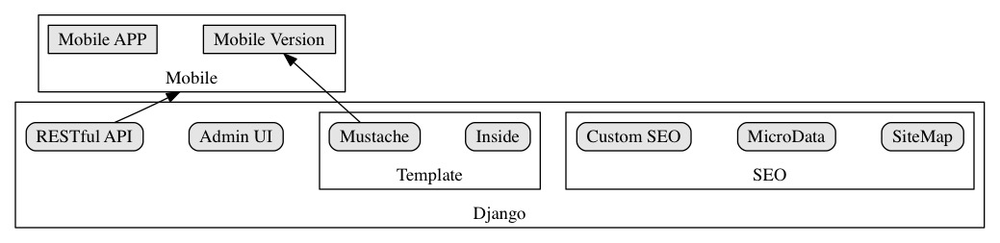

# Echoes CMS

> A Django CMS, follow trend.

##Goals

- Basic CMS with Mustache
- API for Frontend & Mobile
- More Powerful
- Command Line Interface

##Done

- Admin UI
- Mustache Template Support
- Responsive Nav (Foundation)
- Responsive Layout (Foundation)

###Publishing & Editing System

- Markdown Support

##OnGoing

####More

##Weblog

- Canonical Link For Weblog
- Mustache Render Templates

###Page

- Nav on Page (Mezzanine Like)

##TODO

###Basic

- RESTful API
- Mobile Interface (Browser)
- Mobile API (Browser & APP)

###Publishing & Editing System

- Editing on Page(onging)
